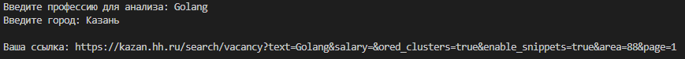
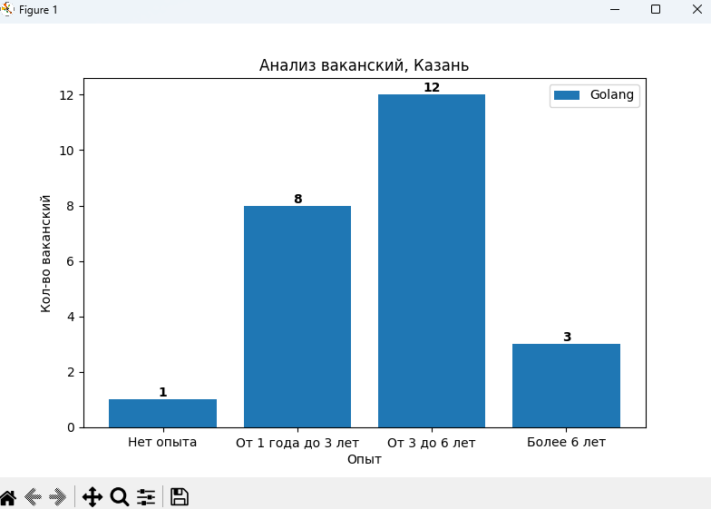
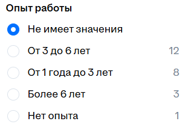

<h2> Цель проекта: </h2>

<h3> Трудности с которыми я столкнулся: </h3>
Сайт динамический и не имеет точных классов объектов, поэтому пришлось решать вопрос с помощью сортировки по словарю div обекта с определенным классом 

<h2 style="margin-top: 300px;">Проект</h2>

Пользователь вводит

      
      
    

